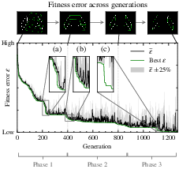
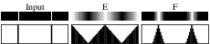
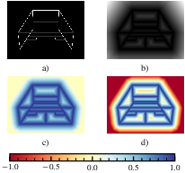
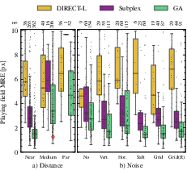
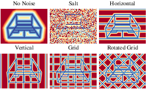
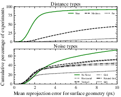
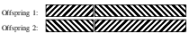
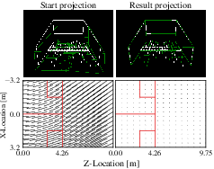
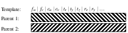
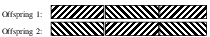

# Results for a genetic algorithm for camera resectioning / calibration in squash

This repository contains the files used for creating results and figures. See the `output` folder for images and the `HTML` folder for scripts. Here are some thumbnails:

### Citation

Please cite in your publications if it helps your research:

    TBA
